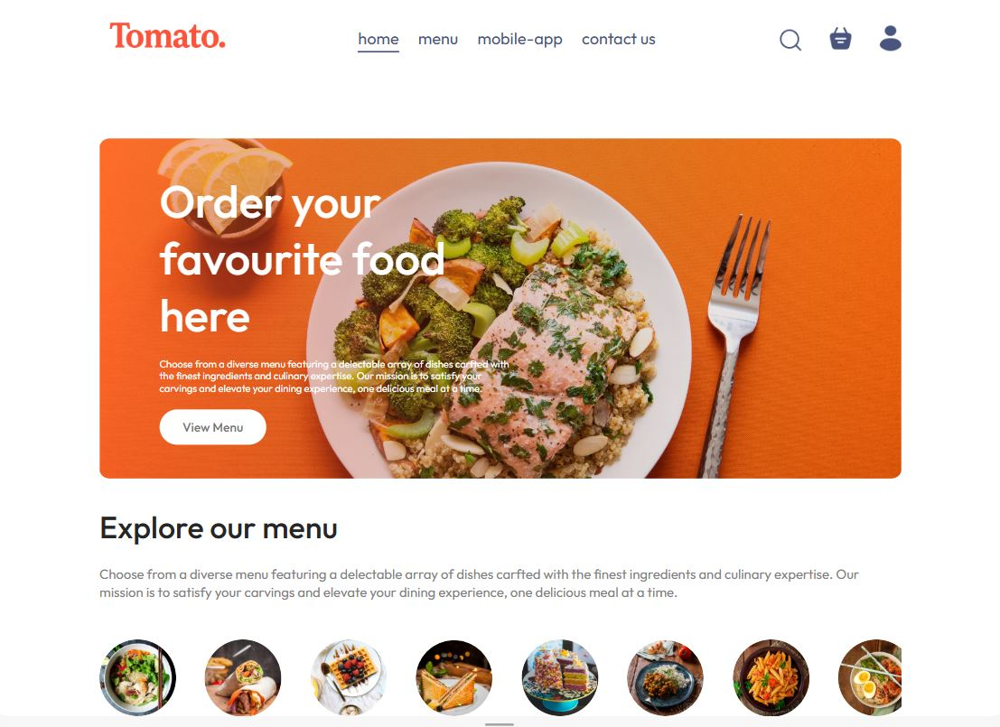
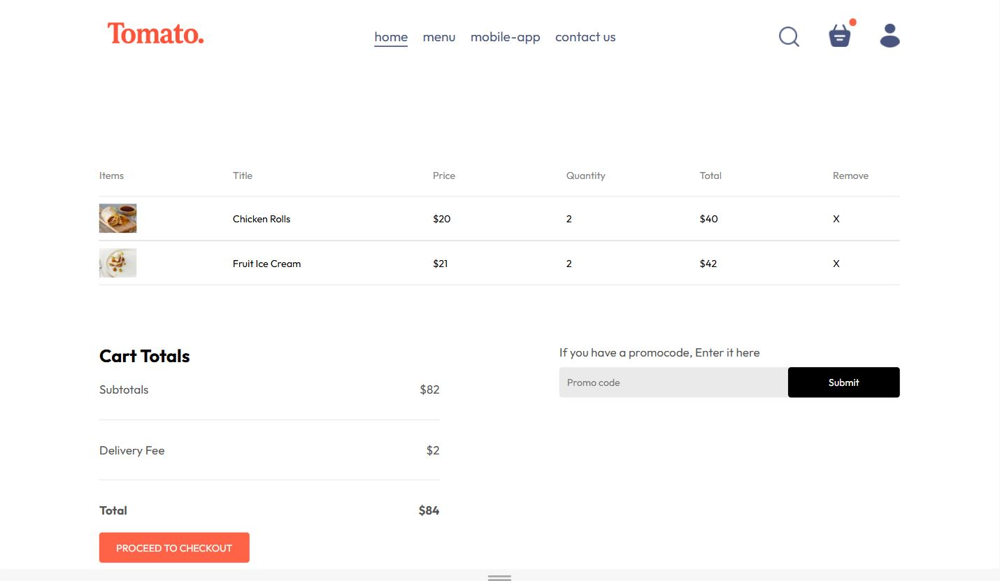
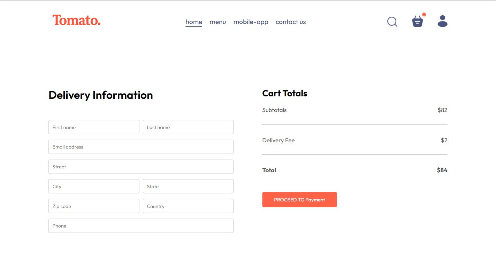
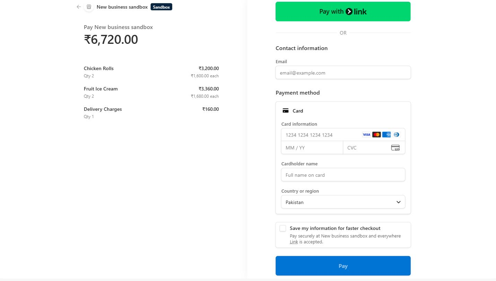
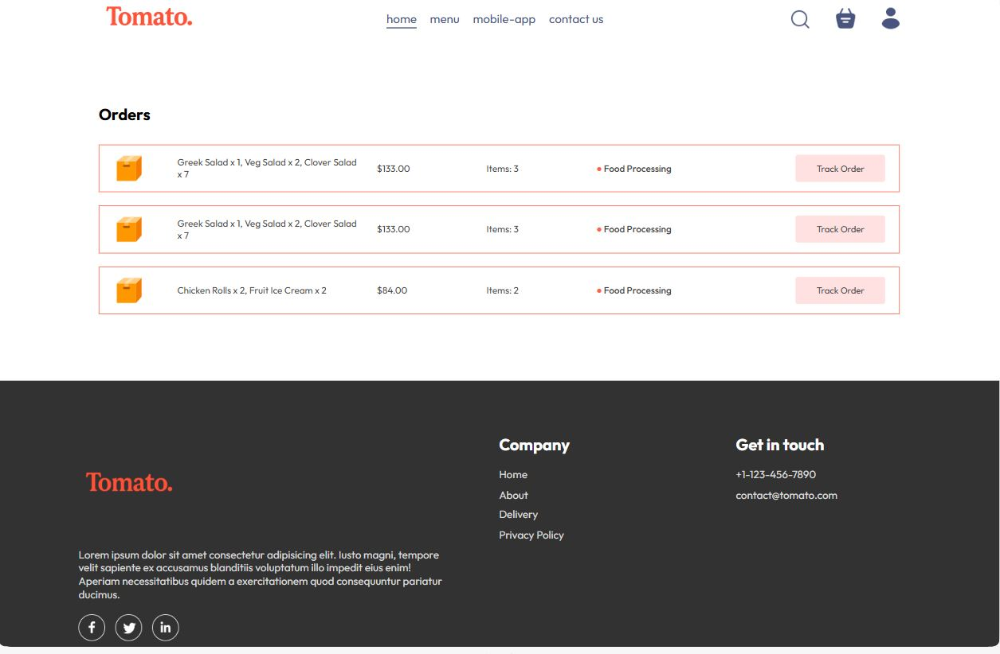
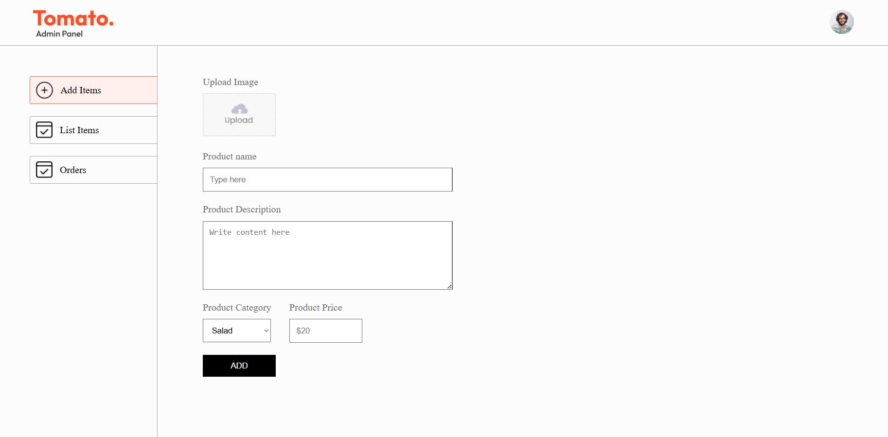

# 🍔 Food Delivery MERN Stack Application

A complete Full Stack Food Delivery Web Application built using the MERN Stack (MongoDB, Express.js, React.js, Node.js). Users can browse food items, add them to the cart, place orders, and make secure online payments using Stripe.

---

## 🚀 Features

### 👤 Authentication

- User Registration
- User Login
- JWT Authentication
- Protected Routes

### 🍽 Food Menu

- Browse all food items
- Filter by category
- Food details with image
- Responsive UI

### 🛒 Shopping Cart

- Add items to cart
- Remove items
- Update quantity
- Automatic cart total calculation

### 🚚 Checkout

- Delivery Information Form
- Order Summary
- Cart Total
- Delivery Charges

### 💳 Online Payment

- Stripe Payment Gateway
- Secure Checkout
- Payment Success Handling

### 📦 Orders

- Place Orders
- View Order History
- Track Orders

### 🛠 Admin Features

- Add New Food
- Delete Food
- Upload Food Images
- Manage Food Items

---

# 🛠 Tech Stack

### Frontend

- React.js
- React Router
- Context API
- Axios
- CSS

### Backend

- Node.js
- Express.js
- MongoDB
- Mongoose
- JWT Authentication
- Multer
- Stripe API

---

# 📂 Project Structure

```
Food-Delivery/
│
├── frontend/
├── backend/
├── admin/
└── README.md
```

---

# 📸 Screenshots

## 🏠 Home Page



---

## 🍽 Food Menu


---

## 🛒 Shopping Cart



---

## 🚚 Checkout



---

## 💳 Stripe Payment



---

## 📦 My Orders



---

## 🛠 Admin Dashboard



---

# ⚙ Installation

Clone the repository

```bash
git clone https://github.com/YourUsername/Food-Delivery.git
```

Move into the project

```bash
cd Food-Delivery
```

Install dependencies

```bash
npm install
```

Run Backend

```bash
npm run server
```

Run Frontend

```bash
npm run dev
```

Run Admin

```bash
npm run dev
```

---

# Environment Variables

Create a `.env` file inside the backend.

```env
PORT=4000

MONGO_URI=Your MongoDB URI

JWT_SECRET=Your Secret

STRIPE_SECRET_KEY=Your Stripe Secret
```

---

# Future Improvements

- Order Status Updates
- Admin Order Management
- Search Food
- Wishlist
- Reviews & Ratings
- Email Notifications

---

# 👨‍💻 Author

**Muhammad Hassan**

Computer Science Graduate

Full Stack MERN Developer

LinkedIn: (www.linkedin.com/in/muhammad-hassan-249408293)

GitHub: https://github.com/Hassoo-000